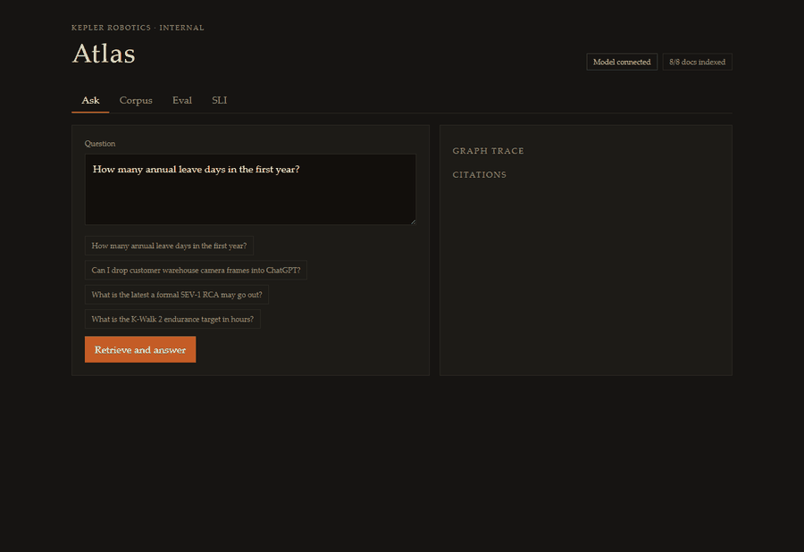
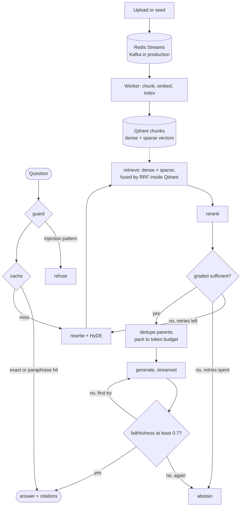

# Atlas AI

Production RAG platform for internal handbook Q&A. Hybrid retrieval, a corrective LangGraph pipeline, faithfulness gating, and an offline eval harness — built so every component maps to a real failure mode, not a buzzword checklist.

**Demo flow:** seed corpus → ask a question → inspect citations and graph trace → run the golden-set eval.



One question against the deployed stack, uncut: guard, a cache miss, query
rewrite, hybrid retrieval in a single Qdrant call
(`dense+sparse rrf=24 docs=8`, 213ms), the rerank node cutting 24 candidates to
12, LLM grading, parent-passage packing, a streamed answer, and the
faithfulness gate scoring it 1.00 — 4.7s end to end. The cross-encoder is off in
this deployment, so that step is a truncation rather than a rerank; the
[ablation](docs/retrieval-ablation.md) is why. Recorded by
`scripts/capture_demo.py`, which drives the real UI and refuses to write a GIF
whose trace shows a cache hit — recording the wrong pipeline is a two-word
difference nobody checks before committing the frames.

## Highlights

| Area | Implementation |
| --- | --- |
| **Retrieval** | Parent-child chunking; dense + sparse vectors in one Qdrant collection, fused server-side by RRF; LLM document grading |
| **Generation** | SSE streaming; token-budget packing over deduplicated parent passages; faithfulness gate that abstains |
| **Orchestration** | LangGraph — guard → cache → rewrite → retrieve → rerank → grade → compress → generate → faithfulness |
| **Quality** | 53-question golden set tagged by failure mode, plus an ablation with a control row that measures its own noise floor |
| **Safety** | API-key auth, per-principal cache isolation and rate limiting; injection resistance measured across 17 attacks × 4 configurations |
| **Ops** | 521MB image, non-root uid; horizontally scalable — no retrieval state in process memory; 592 rps cached, no head-of-line blocking |
| **Ingest** | Async worker queue (Redis Streams, or Kafka); uploads streamed under a byte budget; the two stores reconciled at startup |

## What the measurements said

Every claim here has a number behind it, and several of those numbers are
unflattering. Those are the ones worth reading first — each links to the run
that produced it.

- **[Hybrid retrieval and the cross-encoder buy nothing on this corpus.](docs/retrieval-ablation.md)**
  Fusing sparse into dense matches dense on correctness to three decimals and
  costs context precision. Query rewrite looked worth +3.5pp on 14 questions and
  half a question on 53.

- **[A control row invalidated a whole column.](docs/retrieval-ablation.md)**
  The ablation runs one configuration twice under two names. The pair agreed on
  all 53 questions and every quality metric to three decimals — and their p95
  latencies differ by **2.4x**. That column measures the provider's variance,
  not retrieval.

- **[An upload could write to the application's own source.](docs/ingest-path.md)**
  `filename` came from the client and was joined onto the upload directory
  unchecked, so `../../../../app/main.py` resolved to a file the container's
  non-root uid owns. Verified against the running pod.

- **[A whole subsystem existed to coordinate state that did not need to exist.](docs/sparse-in-qdrant.md)**
  Sparse retrieval was an in-process index rebuilt by every replica, kept in step
  by a revision counter, a poller, a rebuild thread and a snapshot swap. Moving
  the vectors into Qdrant deleted all of it — and retrieved *better* than the
  library it replaced.

- **[Three features shipped silently inert, and none of them failed.](docs/limits.md)**
  API auth was disabled by an env-var name mismatch. The paraphrase cache never
  matched. The CI eval gate skipped every run because a step's own `env` is not
  in scope for that step's `if`. All three looked configured, all three were
  green, and all three were found by testing the deployed system.

- **[Two cost estimates, both wrong, in opposite directions.](docs/cost.md)**
  What a run costs was the one number here that was guessed rather than measured.
  Every model call now records its own usage: $0.0011 per golden-set question,
  $1.12 for a full ablation.

**The deep dives:**
[retrieval ablation](docs/retrieval-ablation.md) ·
[sparse index in Qdrant](docs/sparse-in-qdrant.md) ·
[ingest path](docs/ingest-path.md) ·
[reconciliation](docs/reconciliation.md) ·
[eval as a job](docs/eval-job.md) ·
[injection resistance](docs/injection.md) ·
[cost](docs/cost.md) ·
[operations](docs/operations.md) ·
[limits](docs/limits.md)

## Architecture



The dashed edges are the parts that are easy to miss: the worker indexes in its
own process and only signals the API through a Redis counter, and the API
rebuilds its sparse index on a background tick rather than inside a request.
[Throughput](docs/operations.md#throughput) is where that choice gets measured.

## Tech stack

**Backend:** FastAPI · LangGraph · Qdrant · Redis · OpenAI-compatible LLM API  
**Frontend:** React · Vite  
**Infra:** Docker Compose · Kubernetes manifests (`infra/k8s/`) · optional Redpanda (Kafka protocol)

## Design decisions

- **Parent-child chunks** — children for search, parents for generation. Fewer, coherent context blocks instead of stuffing raw top-k snippets.
- **Hybrid + RRF + cross-encoder** — dense and sparse vectors sit in one Qdrant collection and are fused there by RRF; a small cross-encoder reranks the top candidates before the LLM grader.
- **Corrective graph, not multi-agent** — one stateful graph that rewrites bad retrieval and abstains on thin evidence.
- **Faithfulness as a serving gate** — scores below 0.7 trigger one regeneration, then abstain. Hallucination control is enforced, not only measured offline.
- **Eval set is part of the product** — graph and chunking changes should pass the golden set before shipping.
- **Single vector store** — Qdrant holds the dense vectors, the sparse ones and the payload filters, and computes IDF across the collection. Handbook Q&A does not need GraphRAG, and the sparse side does not need a second index to keep in step with the first.

These are design intentions. [What each stage actually buys](docs/retrieval-ablation.md)
measures them, and on the current corpus it does not vindicate all of them —
hybrid retrieval and the cross-encoder show no benefit at this scale, and the
corrective loop trades recall for precision and tokens.

## Quick start

Requires Python 3.11+, Node 20+, Docker (Redis + Qdrant).

```bash
git clone https://github.com/Nianchao-Code/Atlas-AI.git
cd Atlas-AI
cp .env.example .env
# Set OPENAI_API_KEY. Compatible gateways: set OPENAI_BASE_URL.

docker compose up -d redis qdrant

cd backend
python -m venv .venv
source .venv/bin/activate          # Windows: .\.venv\Scripts\Activate.ps1
pip install -e ".[dev]"
uvicorn app.main:app --reload --port 8000
```

Second terminal:

```bash
cd frontend
npm install
npm run dev
```

Open http://127.0.0.1:5173 → **Corpus → Load Kepler sample handbook** → **Ask** → **Eval**.

Without an API key the system still indexes and retrieves; generation falls back to extracts. LLM-as-judge metrics degrade to keyword overlap.

Full stack (API + worker + frontend):

```bash
docker compose up --build
```

Kafka-protocol bus (optional):

```bash
docker compose --profile kafka up -d
# Set KAFKA_BROKERS=localhost:19092 in .env
```

## API

Every `/api/v1` route requires an API key (see [Auth](docs/operations.md#auth)); `/health` does not.

| Method | Path | Description |
| --- | --- | --- |
| `GET` | `/health` | Liveness, plus whether auth and an LLM are configured |
| `GET` | `/metrics` | Prometheus scrape (no key; not proxied to the browser) |
| `POST` | `/api/v1/query` | Run the RAG graph (non-streaming) |
| `POST` | `/api/v1/query/stream` | Same graph, streams answer tokens via SSE |
| `POST` | `/api/v1/eval` | Start a golden-set run; returns `202` and a job id ([why](docs/eval-job.md)) |
| `GET` | `/api/v1/eval/{job_id}` | Progress, then the report |
| `GET` | `/api/v1/eval` | The most recent run |
| `GET` | `/api/v1/metrics` | SLI snapshot (latency, cache, tokens) |
| `POST` | `/api/v1/documents/seed` | Load sample handbook |
| `POST` | `/api/v1/documents/reconcile` | Repair catalogue/vector disagreement; `?dry_run=true` reports only ([why](docs/reconciliation.md)) |
| `POST` | `/api/v1/documents` | Upload md / txt / pdf — `415` on other types, `413` over `MAX_UPLOAD_BYTES` (20MiB), `400` if the filename cannot be made safe ([why](docs/ingest-path.md)) |
| `DELETE` | `/api/v1/documents/{id}` | Remove a document |

## Project layout

```
backend/app/     FastAPI, LangGraph pipeline, retrieval, eval
frontend/        Ask · Corpus · Eval · SLI dashboards
samples/corpus   Kepler internal handbook (includes injection test doc)
samples/eval     Golden question set (53 cases, tagged by category)
docs/            Deep dives behind each number above, plus the demo recording
docs/data/       Raw ablation output, so the tables can be audited not believed
scripts/         Deploy, eval gate, and the harnesses behind the numbers above
infra/k8s/       Kubernetes manifests (Redis, Qdrant, API, worker, frontend)
```

## Kubernetes deploy

Requires a local cluster (Docker Desktop Kubernetes or minikube) and `kubectl` context configured.

```powershell
# Enable Kubernetes in Docker Desktop, then:
cd "D:\Atlas AI"
$env:OPENAI_API_KEY = "sk-..."
.\scripts\k8s-deploy.ps1
kubectl port-forward svc/frontend 8080:80 -n atlas
# Open http://127.0.0.1:8080
```

## Eval CI gate

```bash
# Smoke (no API key; used in CI)
python scripts/eval_gate.py --smoke

# Full regression (requires OPENAI_API_KEY)
python scripts/eval_gate.py --full
```

Thresholds live in `samples/eval/thresholds.json` and are set below the worst
of two measured runs, not chosen by feel. The previous
`min_abstention_accuracy: 1.0` was decided by the single abstention question
the set had at the time; there are now seven.

## Limits

Measured and known, not hidden — [the full list](docs/limits.md) names the
replacement for each. The short version: the SLI counters are per-process
(Prometheus is the cross-replica answer); auth is service-level rather than user
identity; the regex injection guard catches literal phrasings and nothing else,
at a measured 7/11 bypass rate; the paraphrase cache catches roughly two thirds
of rewordings; the cross-encoder is off because the ablation measured it at
zero; and an upload whose bytes died with the pod's `emptyDir` cannot be
recovered, only marked failed.

## Sample corpus

Fictional **Kepler Robotics** internal handbook: leave policy, data handling, incident response, vendor terms, and a deliberate indirect-injection document for guardrail testing.
