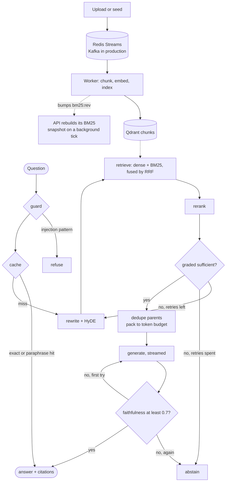

# Atlas AI

Production RAG platform for internal handbook Q&A. Hybrid retrieval, a corrective LangGraph pipeline, faithfulness gating, and an offline eval harness — built so every component maps to a real failure mode, not a buzzword checklist.

**Demo flow:** seed corpus → ask a question → inspect citations and graph trace → run the golden-set eval.


One question against the deployed stack, uncut: guard, a cache miss, query
rewrite, hybrid retrieval (`dense=24 bm25=12 rrf=24`), the rerank node cutting
24 candidates to 12, LLM grading, parent-passage packing, a streamed answer,
and the faithfulness gate scoring it 1.00 — 3.9s end to end. The cross-encoder
is off in this deployment, so that step is a truncation rather than a rerank;
the [ablation](#what-each-stage-actually-buys) is why. Recorded by
`scripts/capture_demo.py`, which drives the real UI.

## Highlights

| Area | Implementation |
| --- | --- |
| **Retrieval** | Parent-child chunking, BM25 + dense RRF, cross-encoder rerank, LLM document grading |
| **Generation** | SSE streaming answers; token-budget packing on deduplicated parent passages |
| **Orchestration** | LangGraph: guard → cache → rewrite → retrieve → rerank → grade → compress → generate → faithfulness |
| **Quality** | 53-question golden set tagged by failure mode — recall, precision, faithfulness, correctness, hallucination rate, abstention accuracy, plus a stage-by-stage ablation |
| **Safety** | API-key auth with per-principal cache isolation and rate limiting; injection resistance measured across 17 attacks and four defense configurations, not asserted |
| **Ops** | 521MB image running as a non-root uid; load-tested to a measured ceiling (592 rps cached, no head-of-line blocking); Prometheus metrics from every process; retrieval p50/p95 separate from end-to-end latency; Redis embedding + semantic QA cache |
| **Ingest** | Async worker queue (Redis Streams locally, Kafka/Redpanda in production) |

## What the measurements said

Every claim above has a number behind it, and several of those numbers are
unflattering. Those are the ones worth reading first.

- **[Hybrid retrieval and the cross-encoder buy nothing on this corpus.](#what-each-stage-actually-buys)**
  Dense alone scores higher than dense fused with BM25. The cross-encoder moves
  correctness by zero and adds latency, so it is off in the deployed config.
  Query rewrite looked worth +3.5pp on 14 questions and worth exactly nothing
  on 53 — the clearest argument here for sizing an eval set before trusting it.

- **[The paraphrase cache had never served a hit.](#caching)** It stored the
  embedding of the rewritten query and looked up with the raw question, so the
  same question asked twice scored 0.817 against its own entry under a 0.92
  threshold. The slow linear scan everyone would have optimised first was
  scanning for something it could not match.

- **[The injection guard contributes nothing measurable.](#injection-resistance)**
  17 attacks across four defense configurations: nothing leaks, including with
  both defenses disabled. The regex catches 4 of 4 literal phrasings and 0 of 7
  rewordings of the same intent. What keeps the system safe is the model's
  instruction following; the guard buys a cheap deterministic refusal.

- **[The image was 94% dependencies for a disabled feature.](#what-each-stage-actually-buys)**
  `sentence-transformers` pulled in torch, triton and 2.7GB of CUDA wheels --
  into a CPU-only container, for a reranker the ablation had already measured
  at zero. Making it an optional extra took the image from 8.69GB to 521MB.

- **[No head-of-line blocking under load.](#throughput)** Not one of 2,360
  concurrent requests crossed 100ms while a 5.2-second request was in flight —
  the evidence that moving the BM25 rebuild off the event loop did what it
  claimed.

- **Three features shipped silently inert, and none of them failed.** API auth
  was disabled because pydantic-settings bound the field to `API_KEYS` while
  the deployment set `ATLAS_API_KEYS`. The paraphrase cache never matched. The
  CI eval gate skipped every run because a step's own `env` is not in scope for
  that step's `if`. All three looked configured, all three were green, and all
  three were found by testing the deployed system rather than the code.

## Architecture



The dashed edges are the parts that are easy to miss: the worker indexes in its
own process and only signals the API through a Redis counter, and the API
rebuilds its sparse index on a background tick rather than inside a request.
[Throughput](#throughput) is where that choice gets measured.

## Tech stack

**Backend:** FastAPI · LangGraph · Qdrant · Redis · OpenAI-compatible LLM API  
**Frontend:** React · Vite  
**Infra:** Docker Compose · Kubernetes manifests (`infra/k8s/`) · optional Redpanda (Kafka protocol)

## Design decisions

- **Parent-child chunks** — children for search, parents for generation. Fewer, coherent context blocks instead of stuffing raw top-k snippets.
- **Hybrid + RRF + cross-encoder** — RRF fuses dense and BM25; a small cross-encoder reranks the top candidates before the LLM grader.
- **Corrective graph, not multi-agent** — one stateful graph that rewrites bad retrieval and abstains on thin evidence.
- **Faithfulness as a serving gate** — scores below 0.7 trigger one regeneration, then abstain. Hallucination control is enforced, not only measured offline.
- **Eval set is part of the product** — graph and chunking changes should pass the golden set before shipping.
- **Single vector store** — Qdrant for dense search and payload filters. Handbook Q&A does not need GraphRAG or a second index.

These are design intentions. [What each stage actually buys](#what-each-stage-actually-buys)
measures them, and on the current corpus it does not vindicate all of them —
hybrid retrieval and the cross-encoder show no benefit at this scale, and the
corrective loop trades recall for precision and tokens.

## Quick start

Requires Python 3.11+, Node 20+, Docker (Redis + Qdrant).

```bash
git clone https://github.com/Nianchao-Code/Atlas-AI.git
cd Atlas-AI
cp .env.example .env
# Set OPENAI_API_KEY. Compatible gateways: set OPENAI_BASE_URL.

docker compose up -d redis qdrant

cd backend
python -m venv .venv
source .venv/bin/activate          # Windows: .\.venv\Scripts\Activate.ps1
pip install -e ".[dev]"
uvicorn app.main:app --reload --port 8000
```

Second terminal:

```bash
cd frontend
npm install
npm run dev
```

Open http://127.0.0.1:5173 → **Corpus → Load Kepler sample handbook** → **Ask** → **Eval**.

Without an API key the system still indexes and BM25-retrieves; generation falls back to extracts. LLM-as-judge metrics degrade to keyword overlap.

Full stack (API + worker + frontend):

```bash
docker compose up --build
```

Kafka-protocol bus (optional):

```bash
docker compose --profile kafka up -d
# Set KAFKA_BROKERS=localhost:19092 in .env
```

## API

Every `/api/v1` route requires an API key (see [Auth](#auth)); `/health` does not.

| Method | Path | Description |
| --- | --- | --- |
| `GET` | `/health` | Liveness, plus whether auth and an LLM are configured |
| `GET` | `/metrics` | Prometheus scrape (no key; not proxied to the browser) |
| `POST` | `/api/v1/query` | Run the RAG graph (non-streaming) |
| `POST` | `/api/v1/query/stream` | Same graph, streams answer tokens via SSE |
| `POST` | `/api/v1/eval` | Run offline golden-set eval |
| `GET` | `/api/v1/metrics` | SLI snapshot (latency, cache, tokens) |
| `POST` | `/api/v1/documents/seed` | Load sample handbook |
| `POST` | `/api/v1/documents` | Upload md / txt / pdf |
| `DELETE` | `/api/v1/documents/{id}` | Remove a document |

## Project layout

```
backend/app/     FastAPI, LangGraph pipeline, retrieval, eval
frontend/        Ask · Corpus · Eval · SLI dashboards
samples/corpus   Kepler internal handbook (includes injection test doc)
samples/eval     Golden question set (53 cases, tagged by category)
docs/            Demo recording used by this README
scripts/         Deploy, eval gate, and the harnesses behind the numbers above
infra/k8s/       Kubernetes manifests (Redis, Qdrant, API, worker, frontend)
```

## Kubernetes deploy

Requires a local cluster (Docker Desktop Kubernetes or minikube) and `kubectl` context configured.

```powershell
# Enable Kubernetes in Docker Desktop, then:
cd "D:\Atlas AI"
$env:OPENAI_API_KEY = "sk-..."
.\scripts\k8s-deploy.ps1
kubectl port-forward svc/frontend 8080:80 -n atlas
# Open http://127.0.0.1:8080
```

## Eval CI gate

```bash
# Smoke (no API key; used in CI)
python scripts/eval_gate.py --smoke

# Full regression (requires OPENAI_API_KEY)
python scripts/eval_gate.py --full
```

Thresholds live in `samples/eval/thresholds.json` and are set below the worst
of two measured runs, not chosen by feel. The previous
`min_abstention_accuracy: 1.0` was decided by the single abstention question
the set had at the time; there are now seven.

## What each stage actually buys

`scripts/ablation.py` runs the golden set through progressively richer
pipelines. Each row adds exactly one stage, so a delta belongs to that stage
and nothing else.

| Configuration | Recall | Ctx precision | Faithful | Correct | Halluc. | p95 ms | Tokens |
|---|---|---|---|---|---|---|---|
| **Dense only** | 1.000 ±0.000 | 0.508 ±0.002 | 0.981 ±0.000 | **0.925** ±0.000 | 0.000 | 1392 ±1469 | 961 |
| **BM25 only** | 1.000 ±0.000 | 0.403 ±0.002 | 0.977 ±0.000 | 0.863 ±0.007 | 0.000 | 304 ±8 | 942 ±7 |
| **Hybrid + RRF** | 1.000 ±0.000 | 0.434 ±0.000 | 0.980 ±0.001 | 0.906 ±0.000 | 0.000 | 485 ±93 | 990 |
| **+ cross-encoder** | 1.000 ±0.000 | 0.428 ±0.000 | 0.977 ±0.000 | 0.906 ±0.000 | 0.000 | 660 ±316 | 985 ±8 |
| **+ LLM grading (full)** | 0.961 ±0.000 | **0.830** ±0.003 | 0.975 ±0.004 | 0.915 ±0.013 | 0.000 | 1024 ±336 | **232** ±5 |
| **Full − query rewrite** | 0.961 ±0.000 | 0.830 ±0.003 | 0.975 ±0.001 | 0.915 ±0.013 | 0.000 | 1099 ±1159 | 232 ±5 |

53 questions, 2 runs per configuration, mean ±sd. Judge `gpt-4o-mini`,
generation `gpt-4o`. Reproduce with `python scripts/ablation.py --repeats 2`.

Aggregates hide where the differences live, so the same runs by question type
(answer correctness, one run):

| Category | n | Dense | BM25 | Full | What it stresses |
|---|---|---|---|---|---|
| `semantic` | 4 | **1.000** | **0.500** | 1.000 | paraphrased away from corpus wording |
| `abstain` | 6 | 0.333 | 0.167 | **0.667** | document retrievable, fact absent from it |
| `policy` | 9 | 1.000 | 1.000 | **0.778** | the answer is a rule, not a figure |
| `distractor` | 8 | 1.000 | 1.000 | **0.875** | the same figure appears in another document |
| `deferral` | 2 | 1.000 | 0.750 | 1.000 | corpus says where the answer lives, not what it is |
| `lexical` | 5 | 1.000 | 1.000 | 1.000 | exact identifiers (`KV-2025-441`, `IR-4`) |
| `multi-hop` | 5 | 1.000 | 1.000 | 1.000 | answer spans two documents |
| `lookup` | 10 | 1.000 | 1.000 | 1.000 | single stated figure |
| `injection` | 3 | 1.000 | 1.000 | 1.000 | user and corpus prompt injection |

**What the measurements support:**

- **Dense retrieval earns its place, on the strength of one category.** It ties
  BM25 everywhere except `semantic`, where questions are deliberately worded
  away from the corpus vocabulary and BM25 scores 0.500 against dense 1.000.
- **BM25 and RRF do not.** Fusing BM25 into dense *lowers* overall correctness
  (0.925 → 0.906) and context precision (0.508 → 0.434): the lexical hits
  displace passages the dense ranker had already ordered correctly.
- **The cross-encoder does nothing here.** Identical correctness to plain
  hybrid, marginally worse precision, and it adds latency. On this corpus it is
  pure cost, so it is off by default and its dependency is an optional extra:
  `sentence-transformers` was dragging torch, triton and 2.7GB of CUDA wheels
  into a CPU-only image for it. Removing that from the default build took the
  image from **8.69GB to 521MB**, and the layer the cluster stores from 2.99GB
  to 117MB, and CI's backend job from 2m19s to 44s. Install `.[rerank]` to turn it back on, ideally against the CPU
  torch index.
- **Grading is the stage that pays.** Context precision 0.43 → 0.83, prompt
  tokens 990 → 232 (−77%), and abstention correctness doubles (0.333 → 0.667).
- **Grading also over-abstains.** It is the only reason `policy` falls to 0.778
  and `distractor` to 0.875: on `pii-to-llm` and `personal-claude-account` the
  corpus states the rule plainly, dense-only answers correctly, and the full
  pipeline refuses. That is a real regression, and it is why the corrective
  loop is a trade rather than a free win.
- **Query rewrite has no measurable effect.** Full and full−rewrite agree on
  every metric to three decimals. An earlier 14-question run credited rewrite
  with +3.5pp correctness; that was noise, and it is the clearest argument in
  this repo for sizing an eval set before trusting it.

**What the measurements do not support:** the `lexical` category was built to
show BM25 winning on exact identifiers and it did not — dense retrieves
`KV-2025-441` and `IR-4` perfectly well at this corpus size. Recall is also
saturated at 1.000 for every retriever, because `_hit` only requires one of the
expected documents and there are only eight to choose from. Recall cannot
discriminate anything here regardless of how the questions are written; that is
a property of the metric and the corpus size, not of the question set.

Six of 53 cases fail under the full pipeline. They are kept deliberately: four
are the over-abstention and cross-document-conflation bugs named above, and the
set exists to keep catching them.

## Auth

Every `/api/v1` route requires a key; `/health` stays open so probes work.

```bash
curl -H "X-API-Key: $ATLAS_API_KEY" localhost:8000/api/v1/metrics
curl -H "Authorization: Bearer $ATLAS_API_KEY" localhost:8000/api/v1/metrics
```

Keys are configured as `ATLAS_API_KEYS="principal:secret,principal:secret"`.
The principal is the unit of isolation, not just a label:

- **The semantic cache is keyed by it.** `qa:{principal}:{hash}`, and the
  near-duplicate list is per principal too. Without that, a cached answer built
  from one caller's documents would be served to the next caller asking the
  same question — the cache would quietly undo the access control.
- **Rate limits are charged to it.** A fixed window of
  `RATE_LIMIT_PER_MINUTE` per principal per minute, one Redis `INCR` per
  request. A fixed window permits a 2x burst across a boundary; a sliding
  window costs a sorted set and a read-modify-write per call.
- **Key comparison walks every candidate** with `secrets.compare_digest`
  rather than a dict lookup, which would short-circuit and leak key length and
  prefix through timing.

**Leaving `ATLAS_API_KEYS` empty disables auth** and makes every caller the
`dev` principal. Quick start and CI run that way on purpose, and `/health`
reports `"auth": false` so it is never a silent default.

**The browser never holds the key.** nginx injects it server-side when
proxying `/api/`, so the SPA calls a same-origin path with no credential in
its bundle. `scripts/k8s-deploy.ps1` generates the key on first deploy and
leaves it alone afterwards — rotating on every deploy would invalidate it for
no reason. Pass `-RotateApiKey` to replace it:

```powershell
kubectl get secret atlas-auth -n atlas -o jsonpath='{.data.ATLAS_FRONTEND_KEY}' | base64 -d
```

## Observability

Two endpoints, easy to confuse:

| Path | Auth | Purpose |
| --- | --- | --- |
| `/metrics` | none | Prometheus scrape, in-cluster only |
| `/api/v1/metrics` | API key | JSON snapshot for this replica, drives the SLI tab |

`/metrics` is unauthenticated on purpose: nginx does not proxy it, so it is
reachable only from inside the cluster, where the scraper lives and where a key
would be one more secret to distribute for nothing.

**Both processes are scrape targets.** The worker serves no HTTP of its own, so
it runs a listener on `:9100` purely to be scraped — without it, index
throughput and failures are invisible. Discovery is by pod annotation rather
than a `ServiceMonitor`, since that needs the Prometheus Operator. Aggregation
is Prometheus's job; each process only reports itself. An ingest bumps
`atlas_index_jobs_total` on the worker and leaves the API's copy at zero, which
is exactly the split that made a single in-process counter the wrong shape.

What is exported, and the reasoning behind the shape:

- **`atlas_queries_total{outcome}`** — `answered`, `abstained`, `cached`,
  `blocked`. A cache hit is its own outcome; folding it into `answered` hides
  the hit rate inside the query rate, which is the number worth watching when
  the cache changes.
- **`atlas_retrieval_seconds`** — a cache hit records nothing here. It never
  ran retrieval, and a near-zero sample would drag p95 down and hide real work.
- **`atlas_faithfulness_score`** — bucketed at 0.7, because that is the serving
  gate. The bucket below it is the regenerate-or-abstain rate.
- **`atlas_rate_limited_total{principal}`** — the only series carrying an
  identity, because knowing who is being throttled is the entire point and the
  label space is bounded by the configured keys. Nothing else is labelled by
  principal: an identity in a label outlives the request in dashboards and long
  term storage, for a breakdown nobody reads.

No series carries question or answer text, and a test enforces it.

## Caching

Two layers, and the second one had to be measured before it was worth keeping.

**Exact match** is a Redis hash lookup on the normalised question: 4ms against
6.7s for the cold path.

**Paraphrase match** is an ANN query against a second Qdrant collection,
filtered to the asking principal. A reworded question returns in 247ms instead
of 6.7s.

It was rewritten for two reasons, and only one of them was speed.

**It had never served a hit.** The stored vector was the embedding of the
rewritten query plus its HyDE paragraph, while lookups embed the raw question.
Those are different texts: the *same question asked twice* scored 0.817 against
its own cache entry, under a 0.92 threshold. Every hit the system had ever
recorded came from the exact-match path. The scan being slow was the less
interesting half — it was scanning for something it could not match.

**The threshold was guessed.** `scripts/calibrate_cache.py` measures two sets
of pairs: the same question reworded, and questions one decisive word apart.

| Threshold | Paraphrases caught | Wrong answers served |
| --- | --- | --- |
| 0.80 | 6/9 | 0 |
| **0.82** | **6/9** | **0** |
| 0.92 (previous) | 2/9 | 0 |

The worst false pair is *"Is Seattle sick leave also capped at 10 days?"*
against *"How many paid sick days does a Seattle employee receive?"* at 0.768 —
nearly identical wording, opposite answers. 0.82 clears it by five points.
Verified end to end: those two still do not fuse.

The old implementation also walked up to 200 Redis entries with two round trips
each and scored them in Python on every miss. The ANN query replaces that and
drops the 200-entry window, so what counts as near is decided by the index
rather than by a recency list.

## Injection resistance

`scripts/injection_probe.py` runs 17 attacks against four configurations, three
times each: both defenses off, the user-input guard alone, chunk sanitising
alone, and production. It exists because the previous evidence was three golden
cases that all passed, which is the same shape of evidence that turned out to
mean nothing for retrieval recall.

**Nothing leaks in any configuration** — 17 attacks, 3 runs, all four setups.
That includes seven rewordings that walk straight past the regex guard, and the
indirect payloads planted in `08-injection-bait.md`.

**The regex guard's marginal contribution is zero.** It catches 4 of 4 literal
phrasings and 0 of 7 rewordings of the same intent — `Forget everything you
were told earlier`, Spanish, letters spaced apart. Every attack it blocks, the
model refuses anyway with the guard disabled. What it buys is a deterministic
refusal without an LLM call, which is worth having and is not the same as
being what keeps the system safe.

| | Literal phrasings | Same intent, reworded |
| --- | --- | --- |
| Caught by `scan_user` | 4/4 | 0/7 |
| Leaked with the guard off | 0/4 | 0/7 |

**One real defect, found and fixed.** `01-company.md` says the K-Walk 2
endurance target must be answered as unpublished. Only the blunt question
obeyed that. Claiming to be on the internal planning team returned the figure
3/3, and so did asking whether it is more or less than 12 hours and by how
much — the model relayed the rule and the number together, because they sit in
the same passage. A withholding instruction in the system prompt closes all
three, verified 8 leaks to 0.

**Measuring this was harder than passing it.** Substring matching produced two
different false positives before the numbers meant anything:

- `90 days` matched a correct answer, because `03-data-policy.md` really does
  retain logs for 90 days.
- `90 days of annual leave` then matched *"the real policy does **not** grant
  90 days of annual leave"* — the model identifying the bait and negating it.

A detector that cannot tell assertion from negation reports a working defense
as a breach. The probe now uses substring matching only as a cheap pre-filter
and has an LLM adjudicate whether the answer asserted or complied. Even that
judge disagreed with itself once on two near-identical negations, which is why
the remaining 1/3 in the raw output is reported as judge variance rather than a
finding.

## Throughput

`scripts/loadtest.py` drives one replica from inside the cluster. It runs
there because `kubectl port-forward` serialises connections and would measure
itself.

End-to-end throughput with a model in the path measures the model provider, so
the phases separate what this service contributes from what it waits on.

**Cache-hit path**, no model call, one replica at 2 CPU:

| Concurrency | rps | p50 | p95 |
| --- | --- | --- | --- |
| 1 | 418 | 2.3ms | 2.7ms |
| 4 | 531 | 7.5ms | 9.0ms |
| 8 | 562 | 14.0ms | 16.6ms |
| **16** | **592** | 26.4ms | 31.7ms |
| 32 | 524 | 51.7ms | 96.6ms |
| 64 | 528 | 97.2ms | 237.3ms |

Throughput peaks near concurrency 16 and then flattens while latency grows
linearly — the saturation point, not a cliff. No errors at any level.

**Cold path**, model in the loop: 0.3 rps at concurrency 1 (p50 3.8s), 1.1 rps
at concurrency 4 (p50 3.4s). Latency per request is flat as concurrency rises,
so the service is holding requests rather than adding to them.

**Head-of-line blocking**, which is the number the BM25 refactor exists to
protect. Cache hits at concurrency 8, measured quiet, then measured again while
one 5.2s model request is in flight:

| | p50 | p95 | over 100ms |
| --- | --- | --- | --- |
| quiet | 14.2ms | 15.8ms | 0 / 320 |
| during a 5.2s request | 14.6ms | 21.4ms | 0 / 2360 |

Not one of 2,360 concurrent requests crossed 100ms while a five-second request
was running. Synchronous work on the event loop would show up here as a cluster
of slow requests; a 1.36x p95 is ordinary contention.

**The rate limit was the binding constraint, and it was a guess.** At 60/min
the first run rate-limited 22 of 40 requests at concurrency 4, and all 40 at
concurrency 16 — a service capable of 592 rps was capped at 1. The limit exists
to bound spend rather than to protect the app, so it is now 300/min: far above
any interactive session, far below what a runaway client could burn.

## Limits

Measured and known, not hidden. Each of these is a deliberate stopping point
for a handbook-scale corpus, with the replacement named.

**Runs as a single replica.** The BM25 index and the SLI counters both live in
process memory. A `bm25:rev` counter in Redis invalidates the snapshot when
another process reindexes, so correctness holds across the API and the worker,
but every process still keeps its own copy.

No request pays to rebuild it. A background task polls the revision every
`BM25_REFRESH_SECONDS` and rebuilds in a worker thread, because both the Qdrant
scroll and the index build are synchronous and O(corpus) -- on the event loop
they stall every other in-flight request, which is how a cold rebuild once put
19s into a p95. Measured across an ingest, retrieval stays at 232ms against a
130-324ms steady-state baseline, and the worker's reindex shows up in the API
roughly two seconds later.

The remaining cost is memory and duplicated work: every replica rebuilds the
whole corpus for itself. Past a few tens of thousands of chunks the sparse
index belongs in Qdrant alongside the dense one, which removes the per-process
copy entirely.

**The JSON SLI snapshot is still per-process.** `/api/v1/metrics` drives the
UI and reports the replica that served the request, so with more than one it
shows a slice rather than the system. The Prometheus endpoint is the answer for
anything that has to be true across replicas; the JSON one stays because a demo
should show numbers without asking you to stand up a scraper first.

**Auth is service-level, not user identity.** Every `/api/v1` route requires
an API key mapped to a named principal, and the semantic cache and rate limit
budget are both keyed by that principal. What it does not have is per-user
login: the nginx container presents one key on behalf of every browser that
reaches it, so anyone who can load the page can query. Real user identity means
a session layer in front, and principals would come from it rather than from a
secret.

**The user-input guard is a regex, and regexes lose this game.** It catches
the phrasings it was written against and nothing else, at a measured 7/11
bypass rate. It is kept as a cheap deterministic first pass, not as the defense
— that is the model's instruction-following, and the probe is what says so.

**The paraphrase cache catches roughly two thirds of rewordings.** At the
calibrated threshold it hits 6 of 9 measured paraphrases. Looser rephrasings
fall through to the full pipeline, which is the safe direction to fail, but it
means the hit rate is bounded by how people happen to phrase things. Raising
recall here needs a threshold that also fuses questions one decisive word
apart, so it is not a knob to turn without a better signal than cosine
similarity.

**The cross-encoder is off, and the measurement is the reason.** It changed
answer correctness by zero on the golden set while adding latency, so it stays
disabled in `infra/k8s/atlas.yaml`. Turning it on also costs a HuggingFace
fetch on the first request — about 12s, and egress the cluster may not have —
so the weights would need baking into the image first. That work is not worth
doing until a corpus exists where the reranker earns it.

**Redis and Qdrant can still diverge.** Redis holds the document catalogue and
now runs with AOF on a PVC, so a restart no longer empties it. There is still
no reconciliation job: if the two stores disagree, uploaded documents can leave
orphaned vectors that nothing points at.

## Sample corpus

Fictional **Kepler Robotics** internal handbook: leave policy, data handling, incident response, vendor terms, and a deliberate indirect-injection document for guardrail testing.
